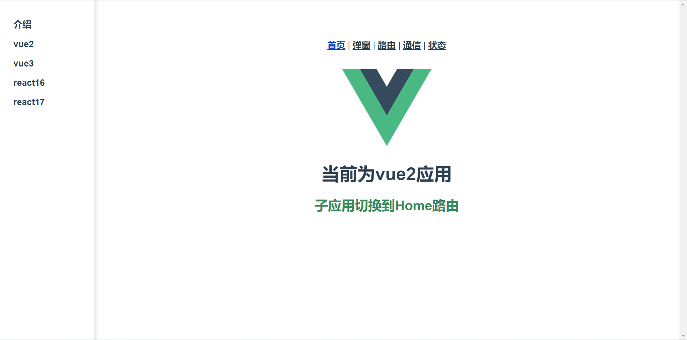

## microAPP-demo

main-vue2 与 vue 2 使用 node 10.24.1 版本。

vue3、react16、react17 使用 node14.19.3 版本。

### 安装方法

到每个应用目录下执行 npm install 。

### 运行方法

基座应用，可以直接使用npm run start 运行，也可以使用Nginx部署。

为方便，各子应用打包后使用Nginx进行部署。Nginx配置文件示例如下所示：

```
// cors.conf
add_header Access-Control-Allow-Origin * always;
add_header Access-Control-Allow-Methods 'GET, POST, OPTIONS';
add_header Access-Control-Allow-Headers 'DNT,X-Mx-ReqToken,Keep-Alive,User-Agent,X-Requested-With,If-Modified-Since,Cache-Control,Content-Type,Authorization';
if ($request_method = 'OPTIONS') {
	return 204;
}
```

```
server {
	listen 7000;
	server_name  localhost;
	location / {
		root microAPP-demo/main-vue2/dist;
		index  index.html index.htm;
		try_files $uri $uri/ /;
	}
}

server {
	listen  7100;
	server_name  localhost;
	include cors.conf;
	location / {
		root microAPP-demo/vue2/dist;
		index  index.html index.htm;
		try_files $uri $uri/ /;
	}
}

server {
	listen  7200;
	server_name  localhost;
	include cors.conf;
	location / {
		root microAPP-demo/vue3/dist;
		index  index.html index.htm;
		try_files $uri $uri/ /;
	}
}

server {
	listen  7300;
	server_name  localhost;
	include cors.conf;
	location / {
		root microAPP-demo/react16/build;
		index  index.html index.htm;
		try_files $uri $uri/ /;
	}
}

server {
	listen  7400;
	server_name  localhost;
	include cors.conf;
	location / {
		root microAPP-demo/react17/build;
		index  index.html index.htm;
		try_files $uri $uri/ /;
	}
}
```

### 运行快照

